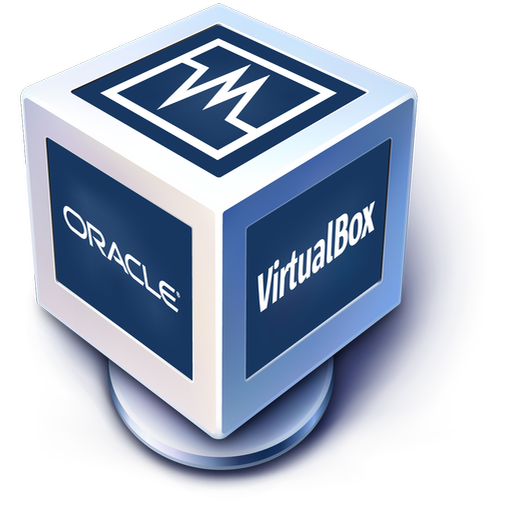

# About the course

???

The goal of this course is to improve familiarity with Unix-like systems. Many
aspects of using Unix and its derivatives are non-obvious, and some are
downright confusing. We hope to help students understand the fundamentals so
that they can begin to feel more comfortable:

- working from a test-based command prompt
- using essential utility applications
- composing custom scripts to automate work and solve problems
- perform basic system administration tasks

Whenever possible, we try to explain the rationale behind the system design so
that students will not have to rely on rote memorization to build confidence.

---

# Conventions

```
pc$ code blocks like these represent a terminal
they are intended to demonstrate various commands
and their effects
pc$
```

???

Lines that begin with `pc$` describe commands that are intended to be entered
into your system's terminal. The `pc$` is sometimes referred to as the
"prompt", and it is intended to designate input lines. The "command" is all
the text that follows the prompt; when typing the command on your system, you
should not include the prompt.

Lines that do not begin with the prompt are "output" lines. This is text
produced by the in response to the command.

Note that terminal examples from other guides use the lone dollar sign
character (`$`) or even the "hash" character (`#`) as the prompt. Whatever it
looks like, the prompt's purpose is the same: to designate the command that
should be typed.

---

:continued:

```
pc$ this command should be run on your system
this is output from your system

vm$ this command should be run in the virtual machine
this is output from the virtual machine
```

???

This course is designed to use a complete Unix-like system that runs as a
standalone process on your computer. This process is known as a "virtual
machine." A small number of commands in this course are intended to be run on
your system, but most of them should be executed within the virtual machine.

The `pc$` prompt denotes commands that are intended to be run on your system.
We'll use the `vm$` prompt to denote the commands that are intended for the
virtual machine.

---

# About the exercises




"[Vagrant Logo](https://commons.wikimedia.org/w/index.php?curid=29324827)" by
[Fco.plj](https://commons.wikimedia.org/w/index.php?title=User:Fco.plj) is
licensed under [CC BY-SA 3.0](http://creativecommons.org/licenses/by-sa/3.0)

???

In order to provide a consistent experience for all students across all
platforms, interactive exercises for this course are authored to be completed
within a "virtual machine." Thanks to the free and open source software
[VirtualBox](https://www.virtualbox.org/),
[Vagrant](https://www.vagrantup.com/), and [Ubuntu](http://www.ubuntu.com/),
students can complete the exercise in a purpose-built Unix-like environment
using their personal computer and at no charge.
